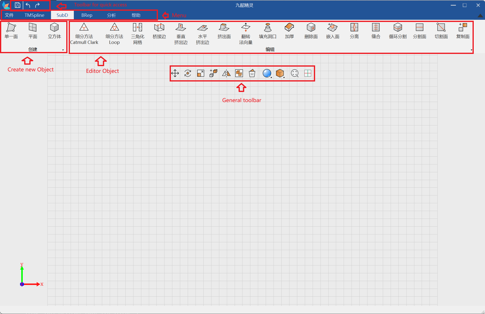
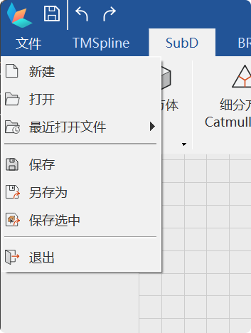

# 九韶精灵 简介

[](./README.zh_cn.md)

**版本 1.0.3**

九韶精灵展示了九韶几何内核支持的一些基本功能。 内核支持更多更丰富的功能，但目前九韶精灵中还暂未使用。 请注意，此项目并不包含 AMCAX 几何内核的使用许可证，您需要到[九韶官网](https://amcax.net/)自行申请许可证。

## 目录

- [如何使用](#如何使用)
  - [用户界面](#用户界面)
  - [创建 / 删除 / 移动几何对象](#创建-删除-移动几何对象)
  - [修改几何对象](#修改几何对象)
  - [持久化几何对象](#持久化几何对象)
  - [辅助功能](#辅助功能)
- [如何构建](#如何构建)
  - [前提条件](#前提条件)
  - [步骤](#步骤)
- [教程](#教程)
  - [代码结构概述](#代码结构概述)
  - [创建几何对象](#创建几何对象)
  - [修改几何对象](#修改几何对象-1)
  - [持久化几何对象](#持久化几何对象)
- [已知问题](#已知问题)
- [许可证](#许可证)
- [联系我们](#联系我们)

## 如何使用

### 用户界面

- 九韶精灵的各项操作区域



### 创建 / 删除 / 移动几何对象

- 要创建一个新的几何对象

  激活 **BRep** 选项卡并选择对象类型，然后：

  - 对于面类型：按顺序点击渲染区域，指定多个点，完成后按 `回车`

  - 对于其他类型：将会出现一个对话框，在对话框中指定几何对象的参数并点击 `确认`

- 要删除对象，选择对象并按 `删除` 键。
- 要移动对象，选择对象，按住鼠标左键，移动到目标点，然后释放按钮

### 修改几何对象

- 要编辑对象，左侧有编辑工具栏，从工具栏中选择操作类型，依次选中要操作的对象并按 `回车` 键确认操作。

### 持久化几何对象



- **保存**:将对象以 `*.amcax` 格式保存，这是 AMCAX 的专有格式，支持 TMSpline, SubD, BRep。

- **另存为**:将对象以 `*.amcax`,`*.stp` `*step` 格式保存。

- **保存选中**:可以选择将对象以 `*.amcax`,`*.stp` `*step` 格式保存。

- 上述所有相关功能都位于`文件`菜单下。

### 辅助功能

- 改变视角

  - 旋转：按住右键并移动以调整

  - 平移：按下左/右/上/下键调整

- 撤销/重做


## 如何构建

### 前提条件

- CMake 3.27 +
- Visual Studio 2019
  - 扩展: Qt VS Tool (请配置 Qt Versions)
- QT 5.15.2
  - 添加 qmake 路径（例如：D:\Qt\5.15.2\msvc2019_64\bin）到 `PATH` 环境变量。
- [九韶几何内核](https://amcax.net/) 3.6.1

### 步骤

- 设置环境变量

  **CMAKE_PREFIX_PATH=%YOUR_QT_INSTALL_DIR%\\msvc2019%YOUR_CPU_ARCH%\\lib\\cmake**

  例如:

  `d:\\qt\\5.15.2\\msvc2019\_64\\lib\\cmake\\`

- 添加九韶几何内核库

  解压库并将其放在此项目根文件夹的相应位置。文件夹结构应如下所示：

```text
    Amcax-Daemon
         |----------AMCAX
         |----------|----------include
         |----------|----------lib
         |----------|----------bin
         |----------Resources
         |----------Src
         |----------third_party
         |----------...
         |----------CMakeLists.txt
```

- 打开 "Visual Studio 2019" 并选择 `continue without code`，导航到 `File` -> `Open` -> `CMake...` 然后打开此项目的 `CMakeLists.txt` 文件。
- 构建
- 将 AMCAX/bin 中的文件夹（`Debug` & `Release`）复制到项目的输出文件夹中。
- 运行 AmcaxDaemon.exe

## 教程

### 代码结构概述

AMCAX daemon 的代码结构如下。

<p align="center">
    <picture>
      
    </picture>
    <p align="center">图三： 代码结构</p>
</p>

它基于 AMCAX Kernel SDK 和 OpenGL。从底层到上层：

- [`Operation`](./Src/Operation/)文件夹中是一些辅助类，它们直接调用内核 SDK 的 API 来创建几何对象，[`ObjectDraw`](./Src/ObjectDraw/)目录下是利用 OpenGL 绘制目标对象的类；

- [`Object`](./Src/Object/)目录中提供了内核集合对象的包装类，这些包装类使用`Operation`和`ObjectDraw`目录中相应的类来支持对几何对象的操作和图形展示。

- [`Core`](./Src/Core/)目录中包含了一个`DataManager`，用于管理所有创建好的几何对象，以及`UndoManager`用于支持“撤销/重做”，而`ACAMFile`中则实现了几何对象的持久化。

- [`Windows`](./Src/Windows/)目录包含与用户交互相关的类，目前利用 libqglviewer 进行相机/投影相关的坐标轴变换。

### 创建几何对象

使用 AMCAX 内核创建对象非常简单：

```cpp
    std::vector<AMCAX::Point3> point_list;
    // TODO:  prepare the points
    std::list<AMCAX::TopoShape> edges;
    for (int i = 1; i < point_list.size(); ++i)
    {
       edges.push_back(AMCAX::MakeEdge(point_list[i-1], point_list[i]));
    }
    edges.push_back(AMCAX::MakeEdge(point_list.back(), (point_list.front())));

    AMCAX::MakeWire mkw;
    mkw.Add(edges);
    AMCAX::TopoShape result = AMCAX::MakeFace(mkw.Wire());
    // TODO: save the result for future use.
```

### 修改几何对象

可以在 MultOperate_BoolFuse 类中找到如何融合多个几何对象。代码非常简单：

```cpp
    std::vector<AMCAX::TopoShape> shapeVector;
    // TODO:  prepare the shapes
    AMCAX::TopoShape resultShape = AMCAX::BoolBRepFuse(shapeVector[0], shapeVector[1]);
    for (int i = 2; i < shapeVector.size(); ++i)
    {
        resultShape = AMCAX::BoolBRepFuse(resultShape, shapeVector[i]);
    }
```

在[`Operation`](./Src/Operation)文件夹中可以找到更多示例。

### Persistent Geometry Objects

基本思路是使用 AMCAD::TopoCompound 和 AMCAD::TopoBuilder 将您想要持久化的对象组合起来，然后将它们保存到 abr 文件中。代码片段如下：

```cpp
    std::string fileName = "foo.abr";
    std::vector<AMCAX::TopoShape> shapeVector;
    //TODO. Prepare the shapes

    AMCAX::TopoCompound comp;
    AMCAX::TopoBuilder build;
    build.MakeCompound(comp);

    std::vector<AMCAX::TopoShape>::iterator it = shapeVector.begin();
    for (; it != shapeVector.end(); it++)
    {
        build.Add(comp, *it);
    }

    AMCAX::ShapeTool::Write(comp, fileName);
```

请参阅[`ACAMCoreFile.cpp`](./Src/Core/ACAMCoreFile.cpp)以获取更多详细信息。

## 已知问题

- 目前仅仅支持撤销/重做对几何对象的创建和删除操作，其他操作暂不支持。因此，如果您创建了一个对象，移动之，然后删除该对象。当您试图撤销删除操作时，您会发现被删除的几何对象虽然会重新出现，但不会在移动后的位置。
- 不能混用 Debug/Release 的内核库。因此，如果您获取到的是 Release 版本的内核库，目前暂时只能编译运行 Release 版本的九韶精灵，但您可以使用最新的 CMakeSettings 配置，以达到调试九韶精灵本身的代码的目的。
- 入 STEP 文件时，需要手动缩放视口大小使得 STEP 文件表示的对象合理显示。

## 许可证

AMCAX-Daemon 采用双重许可制度：开源软件开发按照 GNU Affero 通用公共许可证 v3.0（AGPLv3.0）自由使用，而商业应用可以申请商业许可。

## 联系我们

欢迎提供反馈和贡献！
您可以在这里创建 Git 问题，或者加入我们的[中文社区](https://bbs.amcax.net/)以进一步参与这个项目。

---

**Copyright © 2024 Hefei Jiushao Intelligent Technology Co., Ltd. All rights reserved.**
